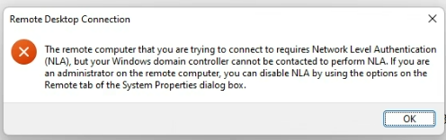
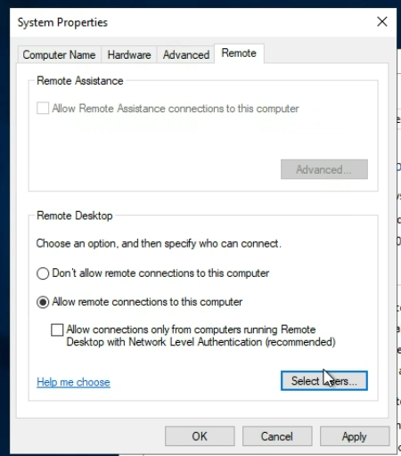

# Troubleshoot Network Connectivity

## [Test-NetConnection][1] from Windows VMs

```PowerShell
# 10.10.10.1 is the remote IP
Test-NetConnection 10.10.10.1 -Port 3389 -InformationLevel "Detailed"

Test-NetConnection -ComputerName "bing.com" -Port 443 -InformationLevel "Detailed"
```

## [Resolve-DnsName][8] from Windows VMs

```PowerShell
# Resolve DNS name
Resolve-DnsName -Name "bing.com"
```

## [GH | ArtiomLK | Use Azure Network Watcher Connection Monitor][3]

## Commands

```console
:: Print local IPv4 CMD
ipconfig | find "IPv4"
```

```Powershell
# Print local IPv4 PowerShell
ipconfig | Where-Object { $_ -match 'Ipv4.*: ((\d{1,3}\.){3}\d{1,3})' } | ForEach-Object { $Matches[1] }
```

## [Enable ICMP / PING][7]

```Powershell
# For IPv4
netsh advfirewall firewall add rule name="ICMP Allow incoming V4 echo request" protocol="icmpv4:8,any" dir=in action=allow

#For IPv6
netsh advfirewall firewall add rule name="ICMP Allow incoming V6 echo request" protocol="icmpv6:8,any" dir=in action=allow
```

## Network Level Authentication (NLA)





- [Disable NLA][5]
- [MS | Disable NLA | Run Command][6]

## Additional Resources

- Network
- [MS | Learn | Test-NetConnection][1]
- [MS | Learn | What address ranges can I use in my VNets?][2]
- Network Watcher
- [MS | Learn | What is Azure Network Watcher?][4]

[1]: https://learn.microsoft.com/en-us/powershell/module/nettcpip/test-netconnection
[2]: https://learn.microsoft.com/en-us/azure/virtual-network/virtual-networks-faq#what-address-ranges-can-i-use-in-my-vnets
[3]: ./nw/nw.md
[4]: https://learn.microsoft.com/en-us/azure/network-watcher/network-watcher-monitoring-overview
[5]: https://learn.microsoft.com/en-us/troubleshoot/azure/virtual-machines/cannot-connect-rdp-azure-vm#workaround
[6]: https://learn.microsoft.com/en-us/azure/virtual-machines/windows/run-command#azure-portal
[7]: https://www.thomasmaurer.ch/2019/09/how-to-enable-ping-icmp-echo-on-an-azure-vm/
[8]: https://learn.microsoft.com/en-us/powershell/module/dnsclient/resolve-dnsname
