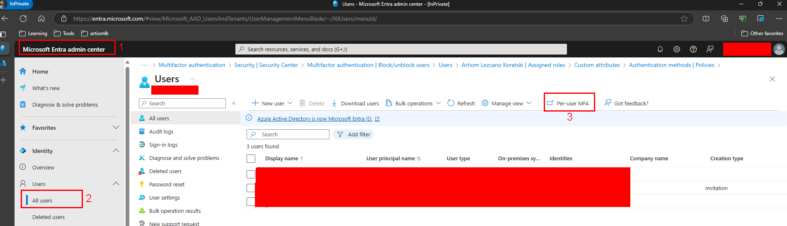
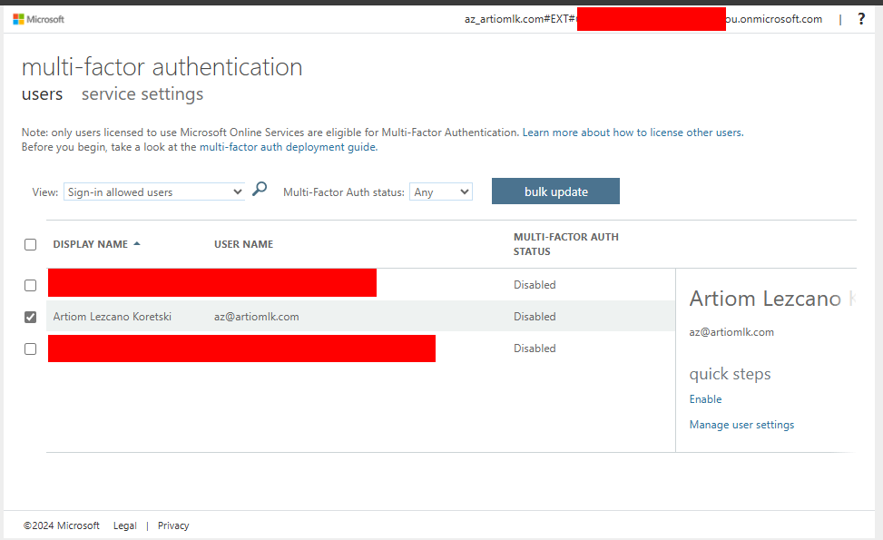

# Increase Quota through CLI

## MFA Required

```bash
(MFARequired) Quota requests needs Multi-Factor Authentication. Please enable Multi-Factor Authentication for your tenant/account by following the instructions at https://learn.microsoft.com/en-us/azure/active-directory/authentication/howto-mfa-userstates and try again.
Code: MFARequired
Message: Quota requests needs Multi-Factor Authentication. Please enable Multi-Factor Authentication for your tenant/account by following the instructions at https://learn.microsoft.com/en-us/azure/active-directory/authentication/howto-mfa-userstates and try again.
```




